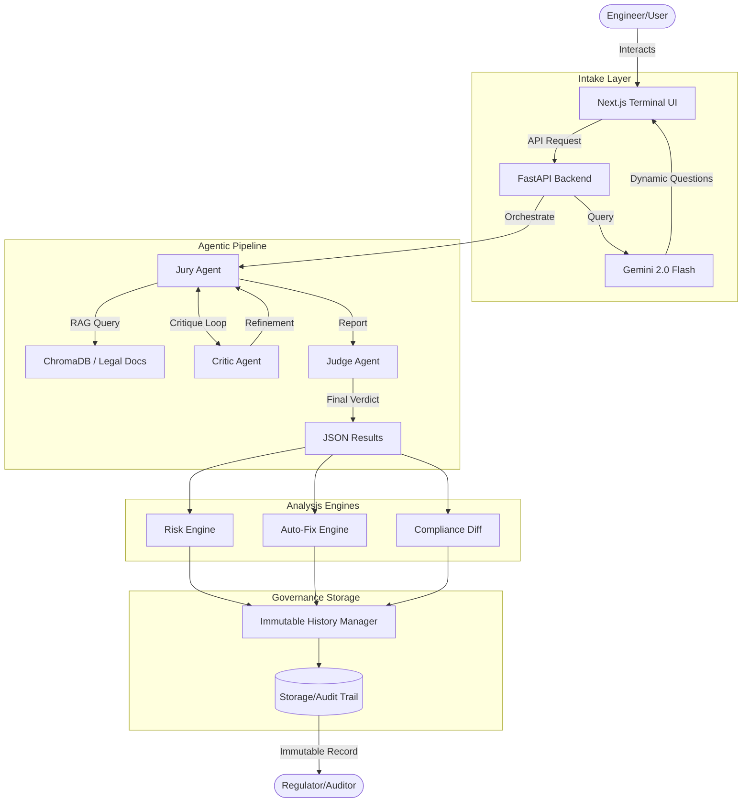
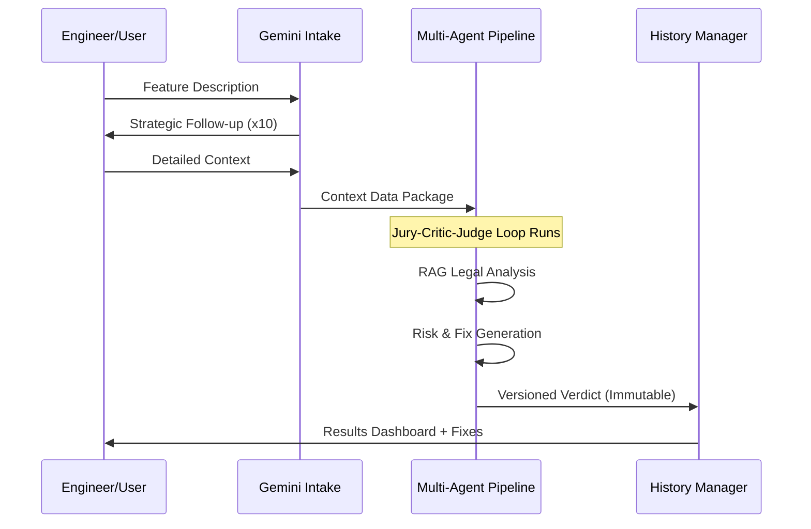

# JurAI: Enterprise-Grade Compliance Orchestration Platform

## 1. Executive Summary / Abstract
JurAI is a sophisticated compliance lifecycle tracking system designed to bridge the structural communication gap between software engineering teams and legal departments. Unlike generic legal chatbots, JurAI is an integrated governance tool that provides a continuous, timestamped, and immutable audit trail of every compliance decision made during the software development lifecycle (SDLC). By leveraging a multi-agent "Jury" system and a Regulatory RAG (Retrieval-Augmented Generation) engine, JurAI identifies potential legal deviations at the point of origin, ensuring that products are "compliant by design."

---

## 2. The Core Problem & Innovative Solution
### The Problem
- **The Language Gap:** Engineers speak in APIs and architectures; lawyers speak in statutes and precedents. This leads to critical compliance requirements being lost in translation.
- **The Visibility Gap:** Most legal reviews are "snapshots" taken at a specific point in time. There is rarely a record of *why* a feature diverged from its original compliance plan during development.
- **The Accountability Gap:** When regulators ask for documentation, companies often struggle to produce a cohesive, chronological history of compliance decisions.

### The JurAI Solution: "The Immutable Timeline"
JurAI's primary value proposition is the generation of a **Complete Chronological Deviation Timeline**. It records every iteration of a feature—from initial idea to final launch—highlighting the exact moment an implementation diverged from an approved legal design. This provides litigation-ready evidence and ensures regulatory peace of mind.

---

## 3. The 5 Stages of the JurAI Lifecycle
JurAI tracks features through five distinct phases:
1.  **Idea Formation:** The engineering team describes a proposed feature.
2.  **Initial AI-Assisted Legal Review:** The agentic system analyzes the feature against global regulations (GDPR, DPDP, DSA, etc.) and internal "Law 0" policies.
3.  **Iterative Revision Tracking:** As engineers modify the feature, JurAI records every change and its corresponding legal impact.
4.  **Final Compliance Verification:** A pre-launch check ensures the final "as-built" product matches the "as-approved" legal design.
5.  **Post-Launch Governance:** In the event of a regulatory inquiry, JurAI generates a comprehensive audit package containing the full versioned history.

---

## 4. Technical Architecture & Tech Stack
JurAI is built on a modern, high-performance stack designed for low-latency AI reasoning and secure data handling.

### Frontend
- **Framework:** Next.js 14 (App Router).
- **Aesthetic:** "Deep Space Command Terminal" – a high-contrast, tactile interface designed for professional precision.
- **Real-time Updates:** Server-Sent Events (SSE) for monitoring multi-agent reasoning in real-time.

### Backend
- **Framework:** FastAPI (Python).
- **AI Orchestration:** LiteLLM (Universal LLM abstraction layer).
- **Local AI Engine:** Ollama (Self-hosted Mistral and Qwen models for sensitive data privacy).
- **Public AI Integration:** Google Gemini 2.0 Flash (Used for dynamic user intake and conversational data gathering).
- **Vector Database:** ChromaDB (Storing indexed legal frameworks and corporate policies).
- **Embeddings:** HuggingFace `all-MiniLM-L6-v2` (Local execution for maximum security).

---

## 5. Key System Features & Capabilities

### A. The Multi-Agent "Jury" System
The core of JurAI's reasoning is an autonomous agentic loop:
- **The Jury Agent:** Conducts initial research, queries the Regulatory RAG engine, and drafts a compliance report.
- **The Critic Agent:** Adversarially reviews the report, looking for logical gaps or missed regulatory nuances.
- **The Judge Agent:** Synthesizes the feedback and issues a final, structured JSON verdict with specific compliance markers.

### B. Dynamic AI Intake Questionnaire
Instead of static forms, JurAI uses Gemini 2.0 Flash to conduct a professional interview with the engineer. It asks strategic follow-up questions to ensure all 10 critical data points (Data storage, AI impact, Jurisdiction, etc.) are captured with sufficient detail.

### C. Regulatory RAG Engine
The platform includes a pre-populated vector store of global regulations:
- **GDPR** (EU), **DPDP** (India), **IT Act** (India), **Digital Services Act** (EU).
- **Regional Laws:** US State laws (Florida, Utah, etc.), COPPA, and more.
- **Law 0 Support:** The ability to ingest and enforce internal company "Shadow Policies" (e.g., specific vendor bans, internal data residency rules).

### D. Engineering-Level "Auto-Fix" Recommendations
JurAI doesn't just identify problems; it provides solutions. The Auto-Fix engine translates legal requirements into actionable engineering tickets (e.g., "Add 256-bit encryption to this specific database field").

### E. Immutable History Manager
Every verdict is stored as a versioned, immutable JSON file on disk. This system ensures that legal records cannot be tampered with after the fact, creating a "Git-like" history for legal compliance.

---

## 6. System Flow & Diagrams

### Data Flow Overview
1.  **User Input:** Engineer interacts with the Gemini-powered Dynamic Questionnaire.
2.  **Context Construction:** System builds a `context_data` package including feature technical details and internal "Law 0" policies.
3.  **The Pipeline:**
    *   `Jury` queries `ChromaDB` for relevant laws.
    *   `Jury` drafts `Initial Report`.
    *   `Critic` identifies weaknesses in `Initial Report`.
    *   `Jury` refines `Report`.
    *   `Judge` issues `Final Verdict`.
4.  **Enrichment:** `Risk Engine` calculates impact scores; `Auto-Fix Engine` generates tickets.
5.  **Storage:** `History Manager` commits a versioned snapshot to the immutable audit trail.
6.  **Presentation:** Real-time feedback is streamed via SSE to the Frontend terminal.

---

## 7. Future Roadmap & Impact
JurAI is designed to scale into a full-scale **Regulatory Operating System**. Future capabilities include:
- **Direct GitHub/GitLab Integration:** Automatically triggers compliance runs on PR creation.
- **Agentic Post-Launch Monitoring:** Scanning production logs to detect deviations from the approved compliance plan in real-time.
- **Multi-Jurisdictional Cross-Mapping:** Automatically translating compliance requirements across 50+ global legal frameworks simultaneously.

---

## 9. PowerPoint Presentation (PPT) Structure
For an AI generating a pitch or progress deck, use the following structure:

- **Slide 1: Title & Vision:** "JurAI: The Operating System for Enterprise Compliance."
- **Slide 2: The Compliance Crisis:** Highlighting the communication rift between SDEs and Legal.
- **Slide 3: Our Core Innovation:** The Immutable Deviation Timeline — "Knowing exactly when compliance failed."
- **Slide 4: Technical Excellence:** A secure hybrid LLM architecture (Gemini + Local Ollama).
- **Slide 5: The Agentic Workflow:** Showcase the Jury-Critic-Judge mechanism for objective analysis.
- **Slide 6: Regulatory RAG:** Scaling to global laws (GDPR, IT Act, DPDP) with sub-second accuracy.
- **Slide 7: Product Impact:** Automated risk scoring and engineering-ready fix recommendations.
- **Slide 8: The Roadmap:** From GitHub integration to real-time production monitoring.
- **Slide 9: Conclusion:** "Compliance is no longer a bottleneck; it's a competitive advantage."

---

## 10. Mermaid System Diagrams

### Architecture Overview

### Compliance Lifecycle Flow

---

## 10. Conclusion
JurAI represents the next generation of Corporate Governance. By automating the tedious task of compliance tracking and translating between technical and legal domains, it enables companies to innovate at speed without sacrificing regulatory integrity. It is not just an AI tool; it is the **Source of Truth** for a company's legal safety.
