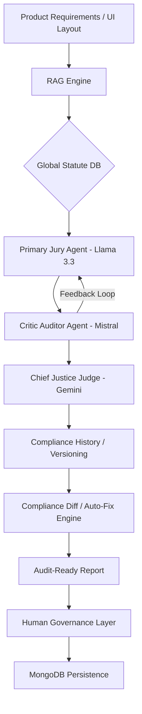

# JurAI
> **Automated Compliance Intelligence for High-Growth Product Teams.**

[](https://nextjs.org/)
[](https://fastapi.tiangolo.com/)
[-blueviolet?style=flat-square)](https://groq.com/)
[](https://www.mongodb.com/)
[](https://www.trychroma.com/)

---

## The Vision
Detect legal and regulatory risks before you build. JurAI is a professional-grade compliance system that uses a multi-agent jury to scrutinize product designs, UI patterns, and regulatory exposure, providing an audit-ready trail for market entry.

---

## Why this is an Interview Conversation Starter

- **Multi-Model Orchestration Layer** — JurAI leverages a heterogeneous model ensemble via LiteLLM: **Llama 3.3 (70B)** for primary analysis, **Mistral** for critical audit (Critic), and **Gemini Flash** for judicial synthesis. This approach balances speed, cost, and reasoning depth.
- **Agent-Critic Consensus Loop** — Implemented an asynchronous refinement cycle where a regulatory agent and a UI auditor peer-review findings. The system iterates until a "No major issues" threshold is reached, significantly reducing hallucination rates in legal contexts.
- **Stateful Compliance (Verdict Versioning)** — Developed a version control system for compliance (`backend/features/compliance_history/`). Every analysis is stored as a versioned verdict, allowing teams to track compliance posture over the product lifecycle, similar to Git for code.
- **Actionable Remediation (Auto-Fix)** — Beyond identifying risks, the system includes an **Auto-Fix Engine** that generates specific implementation steps (UI/Data/Logic) for engineering teams to resolve violations before they hit production.
- **Compliance Diffing Engine** — Built a comparison engine to explain *why* compliance outcomes changed between iterations. It identifies if a score dropped due to a law update (e.g., EU DSA 2026) or a feature change.
- **Event-Driven Architecture (SSE)** — Developed a real-time deliberation tracker using Server-Sent Events (SSE). Users can watch the "internal monologue" and step-by-step reasoning of the agents as they process complex legal statutes.

---

## Core Features

- **RAG-Powered Statute Retrieval** — Uses ChromaDB and LangChain to anchor agent responses in real-world global statutes and regulatory precedents.
- **Deterministic Risk Scoring** — Maps fuzzy LLM outputs to normalized numeric scores (0-100) and categorical risk levels, ensuring reliability for business reporting.
- **Human-in-the-loop (HITL) Governance** — A manual override layer that allows legal professionals to approve, modify, or reject AI-generated verdicts, creating a hybrid trust model.
- **JWT Authentication & Session Management** — Secure, multi-user environment backed by MongoDB for persistent audit logs, session history, and user-specific configurations.

---

## Technical Architecture

JurAI follows a Consensus-First architecture to ensure high-accuracy outputs:



---

## Tech Stack

| Layer | Technology | Why I chose it |
| :--- | :--- | :--- |
| **Frontend** | Next.js 14 + Framer Motion | Premium, tactile UI with monochromatic High-Trust aesthetics. |
| **Backend** | FastAPI | High-concurrency support for multi-agent streaming and RAG retrieval. |
| **Database** | MongoDB | Flexible schema for storing complex execution traces and varying audit log structures. |
| **Vector DB** | ChromaDB | Efficient, local-first RAG implementation for legal knowledge bases. |
| **Inference** | Groq (Llama 3.3) | Sub-second inference latency, essential for interactive agent-critic loops. |
| **Abstraction** | LiteLLM | Provides a unified interface to swap models (Llama, Mistral, Gemini) without re-writing logic. |

---

## Getting Started

### Prerequisites
- Python 3.11+
- Node.js 18+
- MongoDB Instance
- Groq API Key

### Quick Start
```bash
# 1. Setup Backend
cd backend
pip install -r requirements.txt
cp .env.example .env # Configure MONGODB_URI & GROQ_API_KEY
python app.py

# 2. Setup Frontend
cd ../frontend
npm install
npm run dev
```

---

## Roadmap & Tradeoffs

- **If I had more time:** I would implement **Cross-Jurisdictional Switching**, allowing users to toggle between frameworks (GDPR, CCPA, EU AI Act) dynamically.
- **Known Tradeoffs:** 
    - **Greedy Consensus**: The system defaults to a conservative "Risk-Averse" stance if the Jury and Critic cannot reach a 90% confidence agreement.
    - **Sync vs Async Persistence**: While agent execution is async, audit logging to MongoDB is currently synchronous to ensure no compliance trail is lost.

---

## Key Learnings
Building JurAI demonstrated that AI Governance is about bridging the gap between generative reasoning and deterministic reliability. Designing High-Trust systems requires a robust orchestration layer that mimics professional human workflows—Critique, Consensus, and Auditability.

---
Created for the AI Governance and Legal-Tech community.
