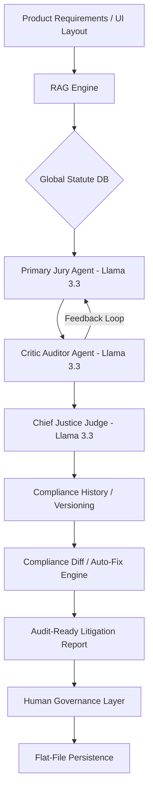

# JurAI
> **Automated Compliance Intelligence for High-Growth Product Teams.**

[](https://nextjs.org/)
[](https://fastapi.tiangolo.com/)
[-blueviolet?style=flat-square)](https://groq.com/)
[](https://www.json.org/)
[](https://www.trychroma.com/)

---

## The Vision
Detect legal and regulatory risks before you build. JurAI is a professional-grade compliance system that uses a multi-agent jury to scrutinize product designs, UI patterns, and regulatory exposure, providing an audit-ready trail for market entry.

---

## Why this is an Interview Conversation Starter

- **Multi-Model Orchestration Layer** — JurAI leverages a heterogeneous model ensemble via LiteLLM: **Llama 3.3 (70B)** for primary analysis and **Llama 3.1 (8B)** for conversational intake and smaller tasks, all powered by **Groq** for sub-second latency.
- **Agent-Critic Consensus Loop** — Implemented an asynchronous refinement cycle where a regulatory agent and a UI auditor peer-review findings. The system iterates until a "No major issues" threshold is reached, significantly reducing hallucination rates in legal contexts.
- **Stateful Compliance (Verdict Versioning)** — Developed a version control system for compliance. Every analysis is stored as a versioned verdict, allowing teams to track compliance posture over the product lifecycle, similar to Git for code.
- **Actionable Remediation (Auto-Fix)** — Beyond identifying risks, the system includes an **Auto-Fix Engine** that generates specific implementation steps (UI/Data/Logic) for engineering teams to resolve violations before they hit production.
- **Compliance Diffing Engine** — Built a comparison engine to explain *why* compliance outcomes changed between iterations. It identifies if a score dropped due to a law update or a feature change.
- **Litigation-Ready Timeline** — Generates a complete chronological audit trail of every compliance decision, highlighting the exact moment of deviation between implementation and approved legal design.
- **Event-Driven Architecture (SSE)** — Developed a real-time deliberation tracker using Server-Sent Events (SSE). Users can watch the "internal monologue" and step-by-step reasoning of the agents as they process complex legal statutes.

---

## Core Features

- **RAG-Powered Statute Retrieval** — Uses ChromaDB and LangChain to anchor agent responses in real-world global statutes (GDPR, DPDP, DSA, etc.).
- **Deterministic Risk Scoring** — Maps fuzzy LLM outputs to normalized numeric scores (0-100) and categorical risk levels, ensuring reliability for business reporting.
- **Conversational Intake** — A dynamic questionnaire powered by Llama 3.1 8B that learns about your feature through a natural dialogue, capturing 10 critical compliance dimensions including "Law 0" internal policies.
- **JWT Authentication** — Secure environment with mock session management for development.

---

## Technical Architecture

JurAI follows a Consensus-First architecture to ensure high-accuracy outputs:



---

## Tech Stack

| Layer | Technology | Why I chose it |
| :--- | :--- | :--- |
| **Frontend** | Next.js 14 + Framer Motion | Premium, tactile UI with high-trust professional aesthetics. |
| **Backend** | FastAPI | High-concurrency support for multi-agent streaming and RAG retrieval. |
| **Persistence** | Flat-File JSON | Lightweight and sufficient for rapid prototyping of versioned compliance records. |
| **Vector DB** | ChromaDB | Efficient, local-first RAG implementation for legal knowledge bases. |
| **Inference** | Groq (Llama 3.3) | Sub-second inference latency, essential for interactive agent-critic loops. |
| **Abstraction** | LiteLLM | Provides a unified interface to swap models without re-writing logic. |

---

## Getting Started

### Prerequisites
- Python 3.11+
- Node.js 18+
- Groq API Key

### Quick Start
```bash
# 1. Setup Backend
cd backend
pip install -r requirements.txt
cp .env.example .env # Configure GROQ_API_KEY
python app.py

# 2. Setup Frontend
cd ../frontend
npm install
npm run dev
```

---

## Roadmap & Tradeoffs

- **If I had more time:** I would implement **Direct GitHub Integration**, allowing compliance runs to trigger automatically on every Pull Request.
- **Known Tradeoffs:** 
    - **Greedy Consensus**: The system defaults to a conservative "Risk-Averse" stance if the Jury and Critic cannot reach a high confidence agreement.
    - **Local Persistence**: Currently uses local file storage; scaling to enterprise would require transition to a robust DB like MongoDB or PostgreSQL.

---

## Key Learnings
Building JurAI demonstrated that AI Governance is about bridging the gap between generative reasoning and deterministic reliability. Designing High-Trust systems requires a robust orchestration layer that mimics professional human workflows—Critique, Consensus, and Auditability.

---
Created for the AI Governance and Legal-Tech community.
